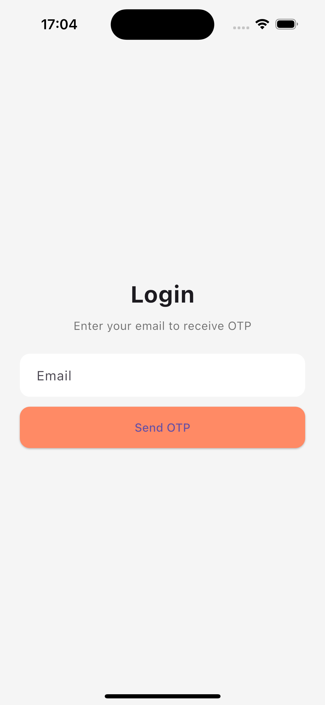
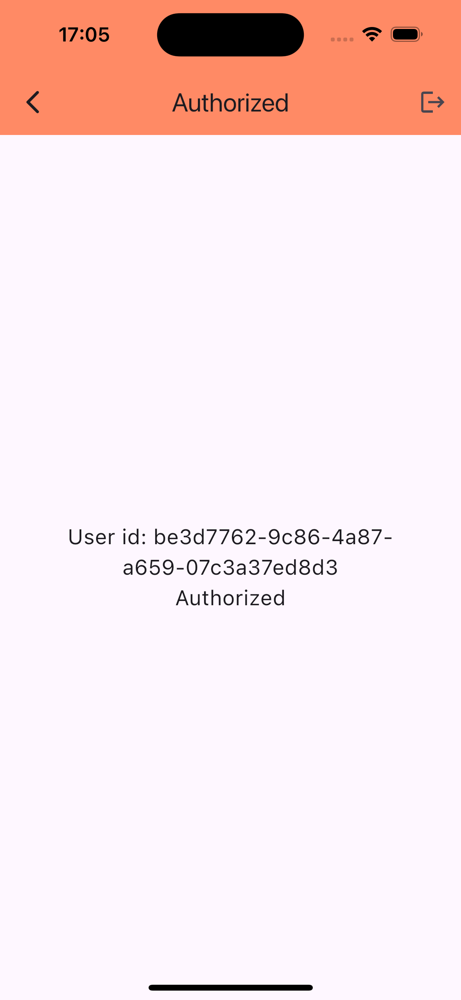

# Test Auth — кратко

Кратко перечислено, что использовано в проекте и как работать.

## Технологии
- Flutter
- Dio — HTTP-клиент
- flutter_bloc — state management (Cubit)
- flutter_secure_storage — безопасное хранение JWT / Refresh Token
- equatable — сравнение состояний
- logger — логирование

## Архитектура
- Clean / разделение слоёв:
  - core/ — network, storage, logger, interceptor
  - features/auth/
    - data/ — datasources (API), models, repositories (AuthRepositoryImpl)
    - domain/ — интерфейс репозитория (AuthRepository)
    - presentation/ — cubit (AuthCubit + состояния), screens (Email, OTP, Authorized)

## Основные фичи
- Авторизация по Email + одноразовый код (OTP).
- Хранение JWT и одноразового Refresh Token в secure storage.
- Интерцептор Dio:
  - добавляет заголовок `Auth: Bearer <jwt>` к запросам;
  - при 401 авто-refresh через RT, заменяет токены и повторяет запросы;
  - очередь запросов во время refresh.
- RT — одноразовый: после refresh сохраняется новый RT.
- При запуске приложения: если есть RT — пытается восстановить сессию (refresh).
- Logout очищает storage и переводит в Unauthenticated.

## API (используемые эндпоинты)
1. POST /login
   - Body: { "email": "user@email.com" }
2. POST /confirm_code
   - Body: { "email": "user@email.com", "code": 12345 }
   - Response: { "jwt": "...", "refresh_token": "..." }
3. POST /refresh_token
   - Body: { "token": "refresh_token" }
   - Response: { "jwt": "...", "refresh_token": "..." }
4. GET /auth
   - Header: Auth: Bearer <jwt>
   - Response содержит user_id

## Ключевые файлы
- lib/main.dart — инициализация, регистрация RepositoryProvider/BlocProvider, маршруты
- lib/core/network/auth_interceptor.dart — Dio interceptor с авто-refresh
- lib/core/storage/secure_storage.dart — wrapper flutter_secure_storage
- lib/core/logger.dart — logger
- lib/features/auth/data/datasources/auth_remote_data_source.dart — вызовы API
- lib/features/auth/data/models/token_model.dart — модель токенов
- lib/features/auth/data/repositories/auth_repository_impl.dart — реализация AuthRepository
- lib/features/auth/domain/repositories/auth_repository.dart — интерфейс
- lib/features/auth/presentation/cubit/auth_cubit.dart (+ state) — логика аутентификации
- lib/features/auth/presentation/screens/
  - email_screen.dart — ввод email
  - otp_screen.dart — ввод кода
  - authorized_screen.dart — экран авторизованного пользователя

## Как запустить (macOS)
1. flutter pub get
2. flutter run

## Полезные заметки
- Email валидируется регулярным выражением; при ошибке показывается сообщение под полем.
- Заголовок с токеном используется как `Auth: Bearer <jwt>` (важно — API ожидает `Auth`).
- Логи печатаются через `logger` (см. core/logger.dart) — смотрите консоль Flutter.
- Если сервер возвращает 4xx/5xx — логируется тело ответа, чтобы упростить

